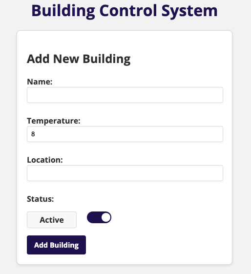
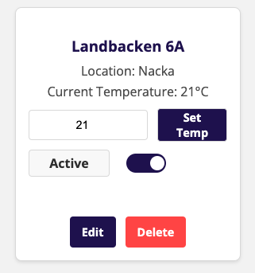
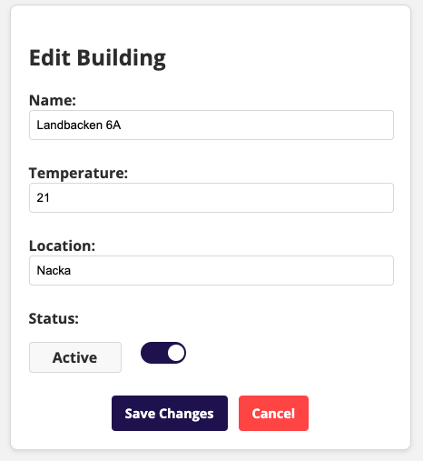

<h1 align="center">🏢 Building Control System</h1>

  
  
  
  

A full-stack application to manage building data, including temperature control, adding, editing, and deleting buildings. The backend supports CRUD operations and stores data in a MySQL database, while the frontend provides a sleek UI for user interactions.

---

<h2>🚀 Features</h2>
<ul>
  <li>🌡️ Temperature Control: Monitor and adjust building temperatures.</li>
  <li>✨ Add Buildings: Enter name, temperature, location, and status.</li>
  <li>👀 View Buildings: See a list of all buildings with real-time updates.</li>
  <li>✏️ Edit Buildings: Modify building details easily.</li>
  <li>🗑️ Delete Buildings: Remove unwanted buildings with a single click.</li>
  <li>💾 Persistent Storage: Data is securely stored in a MySQL database.</li>
</ul>

---

<h2>🛠 Technologies Used</h2>

<h3>Frontend</h3>
<ul>
  <li>⚛️ <strong>React</strong></li>
  <li>📘 <strong>TypeScript</strong></li>
  <li>🌐 <strong>Axios</strong></li>
  <li>🧪 <strong>Jest & Testing Library</strong></li>
</ul>

<h3>Backend</h3>
<ul>
  <li>🟩 <strong>Node.js</strong></li>
  <li>⚡ <strong>Express</strong></li>
  <li>📘 <strong>TypeScript</strong></li>
  <li>🛢 <strong>MySQL</strong></li>
  <li>🧪 <strong>Jest</strong></li>
</ul>

---

<h2>📦 Getting Started</h2>

<h3>Prerequisites</h3>
<ul>
  <li>🟢 Install <a href="https://nodejs.org/" target="_blank">Node.js</a></li>
  <li>🗄️ Install <a href="https://dev.mysql.com/downloads/" target="_blank">MySQL</a></li>
  <li>📥 Install <a href="https://git-scm.com/" target="_blank">Git</a></li>
</ul>

<h3>Installation</h3>
<h3>Clone the Repository</h3>
<pre><code>git clone https://github.com/aleber123/building-control.git
cd building-control</code></pre>

<h3>Install Dependencies</h3>
<pre><code>npm install
cd building-control-backend && npm install
cd ../building-control-frontend && npm install</code></pre>

<h3>Configure Environment Variables</h3>

Create a <code>.env</code> file in the backend directory with:

<pre><code>DB_HOST=localhost
DB_USER=root
DB_PASSWORD=your_password
DB_DATABASE=building_control</code></pre>

<h3>Set Up MySQL Database</h3>
<pre><code>CREATE DATABASE building_control;

USE building_control;

CREATE TABLE buildings (
  id INT AUTO_INCREMENT PRIMARY KEY,
  name VARCHAR(255) NOT NULL,
  temperature FLOAT,
  location VARCHAR(255),
  status VARCHAR(50)
);</code></pre>

<h3>Start the Applications</h3>
<pre><code>cd building-control-backend && npm run dev
cd ../building-control-frontend && npm start</code></pre>

---

<h2>🧪 Testing</h2>

<h3>Running Tests</h3>

The project uses Jest for comprehensive testing of both frontend and backend components. Run tests using these commands from the root directory:

<pre><code># Run all tests (frontend and backend)
npm test

# Run only backend tests
npm run test:backend

# Run only frontend tests
npm run test:frontend

# Run tests in watch mode
npm run test:watch</code></pre>

<h3>Test Structure</h3>
<ul>
  <li>🔙 <strong>Backend Tests:</strong> Located in <code>building-control-backend/src/tests/</code></li>
  <li>🔜 <strong>Frontend Tests:</strong> Located in <code>building-control-frontend/src/tests/</code></li>
</ul>

---

<h2>🌐 API Endpoints</h2>

<h3>Base URL: <code>http://localhost:3001</code></h3>

The application implements a <strong>REST API</strong> with the following endpoints:

<table>
  <tr>
    <th>Method</th>
    <th>Endpoint</th>
    <th>Description</th>
    <th>Request Body</th>
  </tr>
  <tr>
    <td>GET</td>
    <td><code>/buildings</code></td>
    <td>Fetch all buildings</td>
    <td>-</td>
  </tr>
  <tr>
    <td>POST</td>
    <td><code>/buildings</code></td>
    <td>Create a new building</td>
    <td><pre>{
  "name": "string",
  "temperature": number,
  "location": "string",
  "status": "string"
}</pre></td>
  </tr>
  <tr>
    <td>PUT</td>
    <td><code>/buildings/:id</code></td>
    <td>Update a building</td>
    <td><pre>{
  "name": "string",
  "temperature": number,
  "location": "string",
  "status": "string"
}</pre></td>
  </tr>
  <tr>
    <td>DELETE</td>
    <td><code>/buildings/:id</code></td>
    <td>Delete a building</td>
    <td>-</td>
  </tr>
</table>

---

<h2>🎨 Preview</h2>

Below are screenshots of the application:

Figure 1: Screenshot 1 description

Figure 2: Screenshot 2 description

Figure 3: Screenshot 3 description

